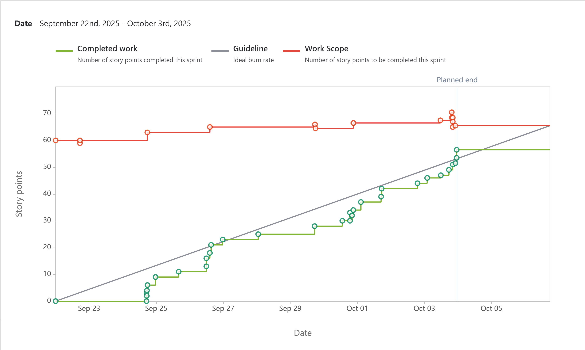
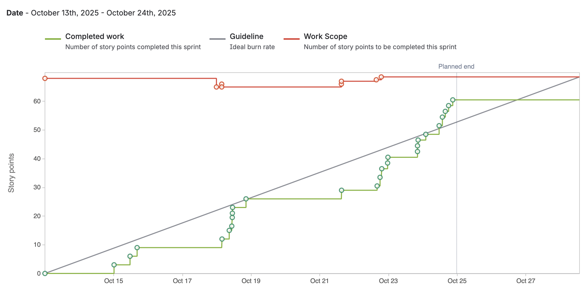
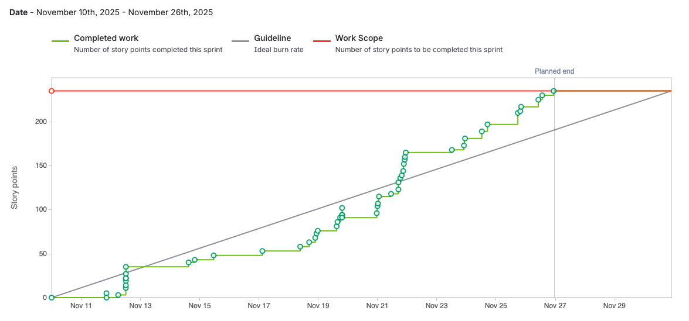

# Balance Bloom

## Description

- Our team consists of Gloria Ejikeme, Jackie Medrano, Jade Wilson, Nina Kesel, Olivia Dixon, and Prakriti Gautam.
- We are creating a web app that would act as a hub for tracking health and wellness. This app will allow users to improve their health and wellness by offering searching for healthy and nutritious recipes, allow users to track their menstrual cycles and allow users to track their mood and energy.
- We’re doing the app for girls and women who either want to learn about self-care or simply keep track of their habits.
- We’re doing this to help more women learn about their personal needs and habits. We want to be able to impact this demographic and inspire them to be the best version of themselves as possible.

## General Information

## Technologies Used

- Basic / Tools: GitKraken, Jira, Slack, Bitbucket, VS Code, GitHub
- Languages: Python, HTML / CSS, JavaScript
- Database: MongoDB
- Frameworks / Libraries: Flask (backend API), React (frontend), Express (if used for additional Node services)

## Features

- Home Page

What it does: This feature will allow users easy acess to current and future features.

Who uses it: App users

User stories:

As a user I would like a easy and clear way to see and acess the services this app provides through a home page.

- Recipe Suggester

What it does: This feature would suggest recipes based on user searches. The searches can be filtered by dietary restrictions (vegan, vegetarian, gluten-free, dairy-free), calorie goals, prep time, and ingredients on hand.

Who uses it: App users (girls/women tracking nutrition).

User stories:

As a user with a gluten sensitivity, I want recipe suggestions that are gluten-free so I can safely eat them.

As a busy student, I want to be able to search for recipes I can cook in under 20 minutes so I can cook on tight schedules.

As someone tracking calories, I want to log the suggested meal to my daily intake.

- Favorite Recipes

What it does: This feature would allow users to save their favorite recipes.

Who uses it: App users

User stories:

As a picky eater, I want a easy way to find my favorite recipies

- Menstrual Tracker

What it does: Users input past cycle start/end dates; the app predicts next cycle start, fertile window, and shows cycle history with symptom tagging. Optionally displays reminders (period coming in X days).

Who uses it: Anyone who menstruates and wants cycle awareness.

User stories:

As a user who records period dates, I want to see the predicted next start date so I can prepare.

As someone tracking symptoms, I want to log cramps and mood so I can see patterns over time.

- Mood & Energy Journal

What it does: Daily journal entries for mood, energy level (1-10), tags (sleep, exercise, recipe tried), and free-text notes. Provide sentiment summary over time.

Who uses it: Users who want to reflect and track mental/energy trends.

User stories:

As a user who tried a new recipe, I want to write about it so I remember how it made me feel.

As someone tracking mental health, I want to see mood trends over the past month.

---

## Sprint 1 (September 22nd - October 3rd)

## Review and Retrospective

- Sprint 1 Retrospective : <https://txst-my.sharepoint.com/:p:/g/personal/eqe1_txstate_edu/EaS1GB_HendJqEbtKYF1jn4BTT-1iLLkRQnz2xkOtYC8vQ?e=adSMI6>

## Burnup Chart

### Contributions

**Olivia:** Implemented the HTML page and corresponding CSS for the cycle tracker; added a functional, up-to-date calendar UI that is interactable and currently allows the user to mark their current cycles, along with seeing predicted dates.

- `Jira Task - SCRUM-89: Create an HTML page for the period tracker`
  - [Jira link](https://cs3398-jawa-fall.atlassian.net/browse/SCRUM-89?atlOrigin=eyJpIjoiMmUyMWUxOGFhMWFkNGZlMGJlMGVlOTUyYjc0ZDA2MGYiLCJwIjoiaiJ9)
  - [Bitbucket pull request](https://bitbucket.org/cs3398-jawa-f25/balance_bloom/pull-requests/6)
- `Jira Task - SCRUM-15: Design the Calendar UI`

  - [Jira link](https://cs3398-jawa-fall.atlassian.net/browse/SCRUM-15?atlOrigin=eyJpIjoiMjI5YjUwNDNhM2Q3NDZkZGJjYTBhZmY1OTNmNWUxZTYiLCJwIjoiaiJ9)
  - [Bitbucket pull request](https://bitbucket.org/cs3398-jawa-f25/balance_bloom/pull-requests/13)

- `Jira Task - SCRUM-16: Implement Cycle Prediction Algorithm`

  - [Jira link](https://cs3398-jawa-fall.atlassian.net/browse/SCRUM-16?atlOrigin=eyJpIjoiOGU3ZjI0YzUzNzllNDMxYzliZjUzNjg1MWM5NTI5N2UiLCJwIjoiaiJ9)
  - [Bitbucket pull request](https://bitbucket.org/cs3398-jawa-f25/balance_bloom/pull-requests/19)

- `Jira Task - SCRUM-17: Integrate Calendar Highlighting with Prediction`

  - [Jira link](https://cs3398-jawa-fall.atlassian.net/browse/SCRUM-17?atlOrigin=eyJpIjoiNmI0ZWJmMTNiZDNhNDRjNTkyMzBmMTExOTdkYjc2NDciLCJwIjoiaiJ9)
  - [Bitbucket pull request](https://bitbucket.org/cs3398-jawa-f25/balance_bloom/pull-requests/24)

- `Jira Task - SCRUM-41: Unit Testing & Validation`
  - [Jira link](https://cs3398-jawa-fall.atlassian.net/browse/SCRUM-41?atlOrigin=eyJpIjoiYmQzMTVkNzNiNWQ3NDc0NDg0NWY0NzNjNjExNmNkMDEiLCJwIjoiaiJ9)
  - [Bitbucket pull request](https://bitbucket.org/cs3398-jawa-f25/balance_bloom/pull-requests/26)

**Jade:** Implemented the fundamentals for Flask and some user functions to begin to implement functionality into the application, as well as research in case Flask was inoperable for our project.

- `Jira Task - SCRUM-66: Set up Flask project structure`
  - [Jira link](https://cs3398-jawa-fall.atlassian.net/browse/SCRUM-66)
  - [Bitbucket pull request](https://bitbucket.org/cs3398-jawa-f25/balance_bloom/pull-requests/2)
- `Jira Task - SCRUM-93: Researching deployable application programs`

  - [Jira link](https://cs3398-jawa-fall.atlassian.net/browse/SCRUM-93)
  - [Bitbucket pull request](https://bitbucket.org/cs3398-jawa-f25/balance_bloom/pull-requests/4)

- `Jira Task - SCRUM-77: Create settings page with forms`

  - [Jira link](https://cs3398-jawa-fall.atlassian.net/browse/SCRUM-77)
  - [Bitbucket pull request](https://bitbucket.org/cs3398-jawa-f25/balance_bloom/pull-requests/7)

- `Jira Task - SCRUM-76: Provide helper function for CRUD (such as create_user(), get_user(), update_user(), delete_user())`
  - [Jira link](https://cs3398-jawa-fall.atlassian.net/browse/SCRUM-76)
  - [Bitbucket pull request](https://bitbucket.org/cs3398-jawa-f25/balance_bloom/pull-requests/10)

**Nina:** Implemented the UI for the journal entry submitions, researched MongoDB and implementation with Python/Flask, and set up the database with MongoDB Atlas.

- `Jira Task - SCRUM-58: Design the Journal Entry UI HTML`
  - [Jira link](https://cs3398-jawa-fall.atlassian.net/browse/SCRUM-58)
  - [Bitbucket pull request](https://bitbucket.org/cs3398-jawa-f25/balance_bloom/pull-requests/18)
- `Jira Task - SCRUM-87: Reaserch how to use mongoDB`
  - [Jira link](https://cs3398-jawa-fall.atlassian.net/browse/SCRUM-87)
  - [Bitbucket pull request](https://bitbucket.org/cs3398-jawa-f25/balance_bloom/pull-requests/1)

**Jackie:** Implemented the UI for our Home Page, FAQ page, and About Us page using HTML and CSS formatting. As well as implemented the UI to display previous journal entries.

- `Jira Task - SCRUM-61: Create UI to display Past Journal Entries`
  - [Jira link](https://cs3398-jawa-fall.atlassian.net/browse/SCRUM-61)
  - [Bitbucket pull request](https://bitbucket.org/cs3398-jawa-f25/balance_bloom/pull-requests/22)
- `Jira Task - SCRUM-69: Create a Home Page`

  - [Jira link](https://cs3398-jawa-fall.atlassian.net/browse/SCRUM-69)
  - [Bitbucket pull request](https://bitbucket.org/cs3398-jawa-f25/balance_bloom/pull-requests/15)

- `Jira Task - SCRUM-71: Create an about page`

  - [Jira link](https://cs3398-jawa-fall.atlassian.net/browse/SCRUM-71)

- `Jira Task - SCRUM-70: Create an FAQ page`
  - [Jira link](https://cs3398-jawa-fall.atlassian.net/browse/SCRUM-70)

**Prakriti** Implemented the Recipe Recommendation feature using React and integrated it with the Spoonacular API to fetch personalized recipe data. Connected the React frontend to the Flask backend to enable dynamic data exchange between client and server.

- `Jira Task - SCRUM-82: Developing UI for receipe recommender page`

  - [Jira link](https://cs3398-jawa-fall.atlassian.net/jira/software/projects/SCRUM/boards/1?selectedIssue=SCRUM-82)
  - [Bitbucket pull request](https://bitbucket.org/cs3398-jawa-f25/balance_bloom/pull-requests/12)

- `Jira Task - SCRUM-84: Research Receipe/food api`

  - [Jira link](https://cs3398-jawa-fall.atlassian.net/jira/software/projects/SCRUM/boards/1?selectedIssue=SCRUM-84)
  - [Bitbucket pull request](https://bitbucket.org/cs3398-jawa-f25/balance_bloom/pull-requests/11)

- `Jira Task - SCRUM-83: Connect api to our web app`

  - [Jira link](https://cs3398-jawa-fall.atlassian.net/jira/software/projects/SCRUM/boards/1?selectedIssue=SCRUM-83)
  - [Bitbucket pull request](https://bitbucket.org/cs3398-jawa-f25/balance_bloom/pull-requests/17)

- `Jira Task - SCRUM-85: Create a button in home page and link it`

  - [Jira link](https://cs3398-jawa-fall.atlassian.net/jira/software/projects/SCRUM/boards/1?selectedIssue=SCRUM-85)
  - [Bitbucket pull request](https://bitbucket.org/cs3398-jawa-f25/balance_bloom/pull-requests/20)

**Gloria** Implemented the items for the sign-up, login, and account page with functionalitity, dark&light mode capability and database saving. As well as the navigation's bar more options button, logout/deactivate account button and the base routes.

- `Jira Task - SCRUM-67: Add base routing (like /home, /login, /settings, etc.)`
  - [Jira link](https://cs3398-jawa-fall.atlassian.net/jira/software/projects/SCRUM/boards/1?selectedIssue=SCRUM-67)
  - [Bitbucket pull request](https://bitbucket.org/%7B678c7291-54a8-409f-b443-135c83419f33%7D/%7B0ba2be23-5a93-434a-bb0b-1233d9c911f6%7D/pull-requests/9)
- `Jira Task - SCRUM-94: Create sign-up page`
  - [Jira link](https://cs3398-jawa-fall.atlassian.net/jira/software/projects/SCRUM/boards/1?selectedIssue=SCRUM-94)
  - [Bitbucket pull request](https://bitbucket.org/%7B678c7291-54a8-409f-b443-135c83419f33%7D/%7B0ba2be23-5a93-434a-bb0b-1233d9c911f6%7D/pull-requests/14)
- `Jira Task - SCRUM-97: Fix layout navigation tab`
  - [Jira link](https://cs3398-jawa-fall.atlassian.net/jira/software/projects/SCRUM/boards/1?selectedIssue=SCRUM-97)
  - [Bitbucket pull request](https://bitbucket.org/%7B678c7291-54a8-409f-b443-135c83419f33%7D/%7B0ba2be23-5a93-434a-bb0b-1233d9c911f6%7D/pull-requests/25)
- `Jira Task - SCRUM-95: Create login page`
  - [Jira link](https://cs3398-jawa-fall.atlassian.net/jira/software/projects/SCRUM/boards/1?selectedIssue=SCRUM-95)
  - [Bitbucket pull request](https://bitbucket.org/%7B678c7291-54a8-409f-b443-135c83419f33%7D/%7B0ba2be23-5a93-434a-bb0b-1233d9c911f6%7D/pull-requests/21)
- `Jira Task - SCRUM-98: create account page ui`
  - [Jira link](https://cs3398-jawa-fall.atlassian.net/jira/software/projects/SCRUM/boards/1?selectedIssue=SCRUM-98)
  - [Bitbucket pull request](https://bitbucket.org/%7B678c7291-54a8-409f-b443-135c83419f33%7D/%7B0ba2be23-5a93-434a-bb0b-1233d9c911f6%7D/pull-requests/28)
- `Jira Task - SCRUM-78: Connect account, signup, login, settings page with helper functions`
  - [Jira link](https://cs3398-jawa-fall.atlassian.net/jira/software/projects/SCRUM/boards/1?selectedIssue=SCRUM-78)
  - [Bitbucket pull request](https://bitbucket.org/%7B678c7291-54a8-409f-b443-135c83419f33%7D/%7B0ba2be23-5a93-434a-bb0b-1233d9c911f6%7D/pull-requests/27)

## Next Steps (for Sprint 2)

**Olivia:**

- Connect page to a database
- Create continuous predictions (so someone can plan several month in advance for something)
- Do more bug fixing and testing
- Fix up CSS on the cycle tracker page

**Jade:**

- Connect remaining pages to Mongo.
- Ensure hashing exists for all passwords on the application.
- Correct issue of menu bar not appearing on all pages.
- Help connect APIs to our application.

**Nina:**

- Connect journal entries to MongoDB
- Add functionallity to viewing past entries
- Fix bugs with journal entry back button
- Fix CSS to better blend journal entries with the rest of the web app

**Jackie:**

- Fix up CSS on overall layout of webapp
- Fix bugs regarding home page cloud image action listeners
- Implement unit test for journal entries
- Create Contact Us page

**Prakriti**

- Add more features and buttons inside the Recipe Recommendation page
- Fix issues with API communication between the frontend and backend, ensuring Spoonacular API calls work correctly
- Conduct additional testing and debugging to ensure functionality across components

**Gloria:**

- Upgrade the CSS/Design for the account page, and add user allowed pfps.
- Display any error messages to the users screen when signing up on logging in.
- Change the login screen to a pop-up within the home screen, and add in a reset password/email pop-up.
- Implement a favorites tabs for the recipes reccomendator.

---

---

## Sprint 2 (October 13th - October 24th)

## Review and Retrospective

- Sprint 2 Retrospective : <https://txst-my.sharepoint.com/:p:/g/personal/eqe1_txstate_edu/EdMRDOMnnMZMpTVz6fO2-jsBwFdlOeZ-jtOqOol7z0q-MA>

## Burnup Chart

### Contributions

**Nina:** Connected the Journal entry feature to MongoDB and added create, edit, delete and view functionality for the daily journal entry. Implemented the UI, edit functionality and found assests for the daily mood function.

- `Jira Task - SCRUM-59: Add and view daily journal entry in MongoDB and app`
  - [Jira link](https://cs3398-jawa-fall.atlassian.net/browse/SCRUM-59)
  - [Bitbucket pull request](https://bitbucket.org/cs3398-jawa-f25/balance_bloom/pull-requests/29)
  - [Commits](https://bitbucket.org/cs3398-jawa-f25/balance_bloom/pull-requests/29/commits)
- `Jira Task - SCRUM-99: Ability to edit and delete journal entries`

  - [Jira link](https://cs3398-jawa-fall.atlassian.net/browse/SCRUM-99)
  - [Bitbucket pull request](https://bitbucket.org/cs3398-jawa-f25/balance_bloom/pull-requests/33)
  - [Commits](https://bitbucket.org/cs3398-jawa-f25/balance_bloom/pull-requests/33/commits)

- `Jira Task - SCRUM-108: Add UI for mood selection on journal entry`

  - [Jira link](https://cs3398-jawa-fall.atlassian.net/browse/SCRUM-108)
  - [Bitbucket pull request](https://bitbucket.org/cs3398-jawa-f25/balance_bloom/pull-requests/43)
  - [Commits](https://bitbucket.org/cs3398-jawa-f25/balance_bloom/pull-requests/43/commits)

- `Jira Task - SCRUM-110: Update/edit mood image from mongoDB and entry`
  - [Jira link](https://cs3398-jawa-fall.atlassian.net/browse/SCRUM-110)
  - [Bitbucket pull request](https://bitbucket.org/cs3398-jawa-f25/balance_bloom/pull-requests/55)
  - [Commits](https://bitbucket.org/cs3398-jawa-f25/balance_bloom/pull-requests/55/commits)

**Jackie:** Created unit tests for journal entry submission. Implemented UI features to recipe page such as a tips/tricks section, and a pyramind displaying daily nutrients ate.

- `Jira Task - SCRUM-33: Design UI for a "Food Pyramid" graphic for a scale`

  - [Jira link](https://cs3398-jawa-fall.atlassian.net/browse/SCRUM-33)
  - [Bitbucket pull request](https://bitbucket.org/cs3398-jawa-f25/balance_bloom/pull-requests/52)
  - [Commits](https://bitbucket.org/cs3398-jawa-f25/balance_bloom/pull-requests/52/commits)

- `Jira Task - SCRUM-34: Create tips/tricks section under recipe page`

  - [Jira link](https://cs3398-jawa-fall.atlassian.net/browse/SCRUM-34)
  - [Bitbucket pull request](https://bitbucket.org/cs3398-jawa-f25/balance_bloom/pull-requests/51)
  - [Commits](https://bitbucket.org/cs3398-jawa-f25/balance_bloom/pull-requests/51/commits)

- `Jira Task - SCRUM-62: Write Unit Tests for Journal Entry Submission`
  - [Jira link](https://cs3398-jawa-fall.atlassian.net/browse/SCRUM-62)
  - [Bitbucket pull request](https://bitbucket.org/cs3398-jawa-f25/balance_bloom/pull-requests/34)
  - [Commits](https://bitbucket.org/cs3398-jawa-f25/balance_bloom/pull-requests/34/commits)
- `Jira Task - SCRUM-113: Create a Recommnended Foods Section on Recipe Page`
  - [Jira link](https://cs3398-jawa-fall.atlassian.net/browse/SCRUM-113)
  - [Bitbuck pull request](https://bitbucket.org/cs3398-jawa-f25/balance_bloom/pull-requests/46)
  - [Commits](https://bitbucket.org/cs3398-jawa-f25/balance_bloom/pull-requests/46/commits)

**Olivia:** Connected the period tracker page to our database, added the ability to change variable values in the settings which save to the database, squashed some bugs, and revamped the UI.

- `Jira Task - SCRUM-107: Expand on code to allow for continuous tracking.`

  - [Jira link](https://cs3398-jawa-fall.atlassian.net/browse/SCRUM-107)
  - [Bitbucket pull request](https://bitbucket.org/cs3398-jawa-f25/balance_bloom/pull-requests/32)
  - [Commits](https://bitbucket.org/cs3398-jawa-f25/balance_bloom/pull-requests/32/commits)

- `Jira Task - SCRUM-104: Create schema and connect the page to the database.`

  - [Jira link](https://cs3398-jawa-fall.atlassian.net/browse/SCRUM-104)
  - [Bitbucket pull request](https://bitbucket.org/cs3398-jawa-f25/balance_bloom/pull-requests/38)
  - [Commits](https://bitbucket.org/cs3398-jawa-f25/balance_bloom/pull-requests/38/commits)

- `Jira Task - SCRUM-105: Add CRUD operations for the period tracker schema.`
  - [Jira link](https://cs3398-jawa-fall.atlassian.net/browse/SCRUM-105)
  - [Bitbucket pull request](https://bitbucket.org/cs3398-jawa-f25/balance_bloom/pull-requests/45)
  - [Commits](https://bitbucket.org/cs3398-jawa-f25/balance_bloom/pull-requests/45/commits)
- `Jira Task - SCRUM-40: Add relevant user input into the settings page.`

  - [Jira link](https://cs3398-jawa-fall.atlassian.net/browse/SCRUM-40)
  - [Bitbuck pull request](https://bitbucket.org/cs3398-jawa-f25/balance_bloom/pull-requests/50)
  - [Commits](https://bitbucket.org/cs3398-jawa-f25/balance_bloom/pull-requests/50/commits)

- `Jira Task - SCRUM-111: Clean up code and work on CSS.`
  - [Jira link](https://cs3398-jawa-fall.atlassian.net/browse/SCRUM-111)
  - [Bitbucket pull request](https://bitbucket.org/cs3398-jawa-f25/balance_bloom/pull-requests/53)
  - [Commits](https://bitbucket.org/cs3398-jawa-f25/balance_bloom/pull-requests/53/commits)
- `Jira Task - SCRUM-112: Test and bug-fix.`
  - [Jira link](https://cs3398-jawa-fall.atlassian.net/browse/SCRUM-112)
  - [Bitbuck pull request](https://bitbucket.org/cs3398-jawa-f25/balance_bloom/pull-requests/54)
  - [Commits](https://bitbucket.org/cs3398-jawa-f25/balance_bloom/pull-requests/54/commits)

**Jade:** Finished Mongo work from previous Sprint, did the initial rerouting of the Recipe app, added the saving and deleting functionality for the mood tracker, and adjusted UI.

- `Jira Task - SCRUM-96: Help connecting Mongo +loose ends together`
  - [Jira link](https://cs3398-jawa-fall.atlassian.net/browse/SCRUM-96)
  - [Bitbucket pull request](https://bitbucket.org/cs3398-jawa-f25/balance_bloom/pull-requests/31)
  - [Commits](https://bitbucket.org/cs3398-jawa-f25/balance_bloom/pull-requests/31/commits)
- `Jira Task - SCRUM-101: Fixing routes that are missing navigation menu.`

  - [Jira link](https://cs3398-jawa-fall.atlassian.net/browse/SCRUM-101)
  - [Bitbucket pull request](https://bitbucket.org/cs3398-jawa-f25/balance_bloom/pull-requests/35)
  - [Commits](https://bitbucket.org/cs3398-jawa-f25/balance_bloom/pull-requests/35/commits)

- `Jira Task - SCRUM-102: Edit UI for Settings page to match the application`

  - [Jira link](https://cs3398-jawa-fall.atlassian.net/browse/SCRUM-102)
  - [Bitbucket pull request](https://bitbucket.org/cs3398-jawa-f25/balance_bloom/pull-requests/37)
  - [Commits](https://bitbucket.org/cs3398-jawa-f25/balance_bloom/pull-requests/37/commits)

- `Jira Task - SCRUM-48: Implement “Save” / “Delete” button functionality`
  - [Jira link](https://cs3398-jawa-fall.atlassian.net/browse/SCRUM-48)
  - [Bitbuck pull request](https://bitbucket.org/cs3398-jawa-f25/balance_bloom/pull-requests/47)
  - [Commits](https://bitbucket.org/cs3398-jawa-f25/balance_bloom/pull-requests/47/commits)
- `Jira Task - SCRUM-88: Adding security for changing Settings/Account info`
  - [Jira link](https://cs3398-jawa-fall.atlassian.net/browse/SCRUM-88)
  - [Bitbuck pull request](https://bitbucket.org/cs3398-jawa-f25/balance_bloom/pull-requests/48)
  - [Commits](https://bitbucket.org/cs3398-jawa-f25/balance_bloom/pull-requests/48/commits)

**Gloria** Designed, redesigned and allowed customization for the Account and login pages. Added popups and ways the user can add secriuty to their account as well as a way to get their lost account back. (included password reset, email reconvery, email verification...)

- `Jira Task - SCRUM-122: Create pop-up for recover email`
  - [Jira link](https://cs3398-jawa-fall.atlassian.net/browse/SCRUM-122)
  - [Bitbucket pull request](https://bitbucket.org/cs3398-jawa-f25/balance_bloom/pull-requests/58)
  - [Commits](https://bitbucket.org/cs3398-jawa-f25/balance_bloom/pull-requests/58/commits)
- `Jira Task - SCRUM-121: Allow user added pfps`
  - [Jira link](https://cs3398-jawa-fall.atlassian.net/browse/SCRUM-121)
  - [Bitbucket pull request](https://bitbucket.org/cs3398-jawa-f25/balance_bloom/pull-requests/41)
  - [Commits](https://bitbucket.org/cs3398-jawa-f25/balance_bloom/pull-requests/41/commits)
- `Jira Task - SCRUM-74: Create pop-up for reset password`
  - [Jira link](https://cs3398-jawa-fall.atlassian.net/browse/SCRUM-74)
  - [Bitbucket pull request](https://bitbucket.org/cs3398-jawa-f25/balance_bloom/pull-requests/57)
  - [Commits](https://bitbucket.org/cs3398-jawa-f25/balance_bloom/pull-requests/57/commits)
- `Jira Task - SCRUM-73: Change the login page into pop-up`
  - [Jira link](https://cs3398-jawa-fall.atlassian.net/browse/SCRUM-73)
  - [Bitbucket pull request](https://bitbucket.org/cs3398-jawa-f25/balance_bloom/pull-requests/49)
  - [Commits](https://bitbucket.org/cs3398-jawa-f25/balance_bloom/pull-requests/49/commits)
- `Jira Task - SCRUM-80: Upgrade the account page design`
  - [Jira link](https://cs3398-jawa-fall.atlassian.net/browse/SCRUM-80)
  - [Bitbucket pull request](https://bitbucket.org/cs3398-jawa-f25/balance_bloom/pull-requests/42)
  - [Commits](https://bitbucket.org/cs3398-jawa-f25/balance_bloom/pull-requests/42/commits)

**Prakriti** Fixed and stabilized Recipe API integration, added and implemented a functional favorite button in the React app, developed favorite API endpoints, updated the Recipe UI, and tested the favorite feature to ensure smooth functionality.

- `Jira Task - SCRUM-57: Fix and Stabilize Recipe API Integration`

  - [Jira link](https://cs3398-jawa-fall.atlassian.net/browse/SCRUM-57)
  - [Bitbucket pull request](https://bitbucket.org/cs3398-jawa-f25/balance_bloom/pull-requests/30)
  - [Commits](https://bitbucket.org/cs3398-jawa-f25/balance_bloom/pull-requests/30/commits)

- `Jira Task - SCRUM-118: Add favorite button in react app, and make it functional`

  - [Jira link](https://cs3398-jawa-fall.atlassian.net/browse/SCRUM-118)
  - [Bitbucket pull request](https://bitbucket.org/cs3398-jawa-f25/balance_bloom/pull-requests/36)
  - [Commits](https://bitbucket.org/cs3398-jawa-f25/balance_bloom/pull-requests/36/commits)

- `Jira Task - SCRUM-119: Implement Favorites API Endpoints (Flask)`

  - [Jira link](https://cs3398-jawa-fall.atlassian.net/browse/SCRUM-119)
  - [Bitbucket pull request](https://bitbucket.org/cs3398-jawa-f25/balance_bloom/pull-requests/44)
  - [Commits](https://bitbucket.org/cs3398-jawa-f25/balance_bloom/pull-requests/44/commits)

- `Jira Task - SCRUM-120: Testing favorite feature and bug fix`
  - [Jira link](https://cs3398-jawa-fall.atlassian.net/browse/SCRUM-120)
  - [Bitbucket pull request](https://bitbucket.org/cs3398-jawa-f25/balance_bloom/pull-requests/56)
  - [Commits](https://bitbucket.org/cs3398-jawa-f25/balance_bloom/pull-requests/56/commits)

## Next Steps (for Sprint 3)

**Nina:**

- Adding functionality to view past journal entries
- Adding functionality to filter/sort past journal entries
- Creating unit tests
- Working on a user dashboard

**Jackie:**

- Implement MongoDB to pyramid scale graphic
- Implement tailored recommended recipes to each user
- Add and fix naviagtion bar to recipe page
- Create unit tests for user nutrient inputs

**Olivia:**

- Implement fertility marking on calendar
- Work on the ability to toggle period tracking for the Web app
- Add different color options for the Web app’s UI
- Connect new features to database
- Connect new features to the settings

**Jade:**

- Add unit tests for certain portions of our app
- Help connect Recipe app to Mongo (for favorites)
- Adding functions to a user dashboard
- Have journal entries change colors based on mood tracker

**Gloria**

- Display error messages for login/signup.
- Redesign the website so it looks consistent with new customizational colors.
- Creating unit tests.
- Make account profiles public toggable and viewable by others.

**Prakriti**

- Implement user authentication for managing personalized favorites
- Add more search and filter functionality for recipes
- Improve UI/UX with responsive design and loading/error states
- Conduct integration testing and optimize API performance

---

---

## Sprint 3 (November 10th - November 26th)

## Review and Retrospective

- Sprint 3 Retrospective : <https://txst-my.sharepoint.com/:p:/g/personal/eqe1_txstate_edu/IQBVhQ85JH_wQJcqJeicjviiATDaRFN7rZ1-wTPXxtAT0PI?e=CloSef>

## Burnup Chart

### Contributions

**Olivia:** Connected favorite recipes from recipe recommendation page to MongoDB, added fertility tracking and the option to choose whether to track fertility or periods as a whole. Also created unit tests that tested three methods related to the period tracking functionality.

- `Jira Task - SCRUM-139: Create a new file that handles the calculation of fertile dates`
  - [Jira link](https://cs3398-jawa-fall.atlassian.net/browse/SCRUM-139)
  - [Bitbucket pull request](https://bitbucket.org/cs3398-jawa-f25/balance_bloom/pull-requests/63)

- `Jira Task - SCRUM-140: Add onto existing files, such as CSS and UI, to implement the new feature`
  - [Jira link](https://cs3398-jawa-fall.atlassian.net/browse/SCRUM-140)
  - [Bitbucket pull request](https://bitbucket.org/cs3398-jawa-f25/balance_bloom/pull-requests/68)

- `Jira Task - SCRUM-169: Connect MongoDB to the favorite feature`
  - [Jira link](https://cs3398-jawa-fall.atlassian.net/browse/SCRUM-169)
  - [Bitbucket pull request](https://bitbucket.org/cs3398-jawa-f25/balance_bloom/pull-requests/77)

- `Jira Task - SCRUM-141: Add the ability to toggle period and fertility tracking in the settings.`
  - [Jira link](https://cs3398-jawa-fall.atlassian.net/browse/SCRUM-141)
  - [Bitbucket pull request](https://bitbucket.org/cs3398-jawa-f25/balance_bloom/pull-requests/72)

- `Jira Task - SCRUM-144: Create at least 3 unit tests for period tracker`
  - [Jira link](https://cs3398-jawa-fall.atlassian.net/browse/SCRUM-144)
  - [Bitbucket pull request](https://bitbucket.org/cs3398-jawa-f25/balance_bloom/pull-requests/86)

- `Jira Task - SCRUM-145: Record and analyze results to see if they match with expected results`
  - [Jira link](https://cs3398-jawa-fall.atlassian.net/browse/SCRUM-145)
  - [Bitbucket pull request](https://bitbucket.org/cs3398-jawa-f25/balance_bloom/pull-requests/87)

- `Jira Task - SCRUM-136: Research macro and micronutrients related to menstrual cycles.`
  - [Jira link](https://cs3398-jawa-fall.atlassian.net/browse/SCRUM-136)
  - [Bitbucket pull request](https://bitbucket.org/cs3398-jawa-f25/balance_bloom/pull-requests/98)